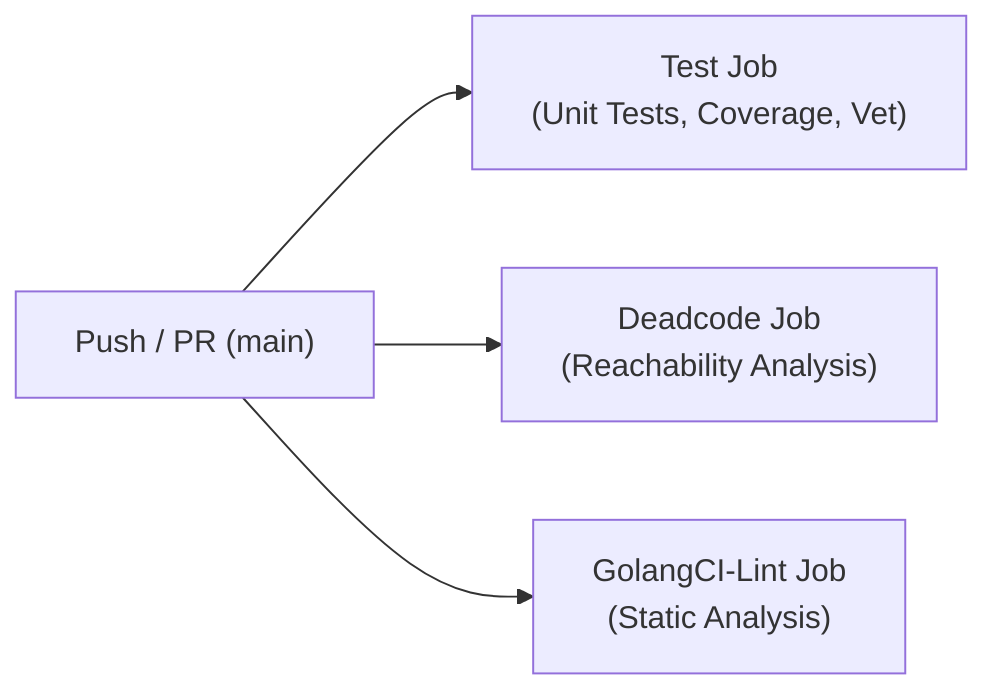

# Continuous Integration & Quality Assurance

Monogo uses automated Continuous Integration (CI) workflows via GitHub Actions to ensure code correctness, memory safety, backwards compatibility, and strict adherence to Go quality standards across all contributions.

The workflow definition is located in [`.github/workflows/ci.yml`](../.github/workflows/ci.yml).

---

## CI Pipeline Overview

The CI pipeline runs automatically on:
- Pushes to the `main` branch.
- Pull requests targeting the `main` branch.

It executes three independent, parallel jobs:



---

## Jobs & Quality Gates

### 1. Test Job (`test`)

- **Environment:** Ubuntu Latest, Go `1.24.x`.
- **Steps:**
  1. **Dependency Verification:** Runs `go mod verify` to guarantee module cache and `go.sum` integrity.
  2. **Go Vet:** Runs `go vet ./...` to detect suspicious constructs.
  3. **Unit Tests, Coverage & Race Detection:** Runs `go test -v -race -count=1 -coverprofile=coverage.out ./...` to verify package logic and catch data races without test caching.
  4. **Coverage Summary:** Generates function-level coverage metrics via `go tool cover -func=coverage.out`.

#### Running Tests Locally

```bash
# Run all tests with race detector and count=1 (requires CGO/C compiler)
go test -v -race -count=1 ./...

# Run tests with coverage profiling and race detector
go test -v -race -count=1 -coverprofile=coverage.out ./...
go tool cover -func=coverage.out
```

---

### 2. Deadcode Analysis Job (`deadcode`)

- **Tool:** Official Go deadcode reachability analyzer ([`golang.org/x/tools/cmd/deadcode`](https://pkg.go.dev/golang.org/x/tools/cmd/deadcode)).
- **Purpose:** Analyzes the call graph using Rapid Type Analysis (RTA) starting from tests and package entry points (`-test ./...`) to ensure that:
  - There are no dead, unreachable, or unreferenced functions/methods anywhere in the library.
  - All exported public API methods, handlers, formatters, and processors are actively covered and reachable.
- **Enforcement:** The job fails if any uncalled code is detected.

#### Running Deadcode Analysis Locally

```bash
go run golang.org/x/tools/cmd/deadcode@latest -test ./...
```

---

### 3. Static Analysis & Linting Job (`golangci-lint`)

- **Tool:** [`golangci-lint`](https://golangci-lint.run/) **v2.14.0** using GitHub Action [`golangci/golangci-lint-action@v9`](https://github.com/golangci/golangci-lint-action).
- **Configuration:** [`.golangci.yml`](../.golangci.yml) (conforming to `version: "2"` specification).
- **Enabled Linters:**
  - **`staticcheck`**: Deep static analysis for Go bugs, deprecated usages, and typed context keys (e.g. SA1029).
  - **`errcheck`**: Ensures returned errors are explicitly handled or documented.
  - **`govet`**: Standard Go vet passes including copy locks, printf formats, and shadow checks.
  - **`ineffassign`**: Detects unused variable assignments.
  - **`unused`**: Checks for unused constants, variables, functions, and types.

#### Running Linter Locally

```bash
# Verify configuration
golangci-lint config verify

# Run linter across all packages
golangci-lint run
```

---

## Architectural & Code Invariants

All pull requests must respect the core project invariants:

1. **Explicit Context Propagation:**
   - Library code in `monogo` and subpackages must **never** instantiate `context.Background()` or `context.TODO()`.
   - The caller's `ctx context.Context` must always be accepted and propagated across all logger and handler lifecycle methods (`Handle`, `HandleBatch`, `IsHandling`, `Close`, `Reset`).
2. **Resettable Lifecycle Contract:**
   - Any component maintaining mutable state between requests or jobs (buffers, deduplication stores, UID caches) must implement `monogo.Resettable` (`Reset(ctx context.Context) error`).
3. **No Unhandled Errors in Tests:**
   - Error returns from lifecycle methods (`Close`, `HandleBatch`, `Reset`) must be checked or explicitly acknowledged to satisfy `errcheck`.
